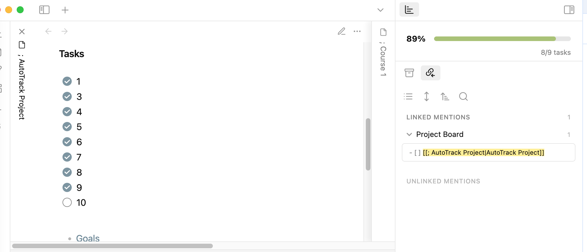

# Progress Tracker

Progress Tracker is an Obsidian plugin that visualizes your task completion progress and helps you stay on top of your work.

## Features

- **Smooth Progress Bar**: Visualizes your task completion progress with an animated, color-coded progress bar
- **Task Tracking**: Automatically counts completed and incomplete tasks in your notes
- **Status Management**: Automatically updates status in the YAML frontmatter based on task progress
- **Kanban Integration**: Moves cards between columns in Kanban boards when tasks are completed
- **Metadata Updates**: Automatically adds completion dates and updates metadata when tasks reach 100%

## Screenshots



## How It Works

The plugin tracks Markdown tasks (`- [ ]` and `- [x]`) in your notes and displays:

- A visual progress bar showing completion percentage
- Task count (complete/total)
- Color-coded indicators for different progress levels

## Installation

1. In Obsidian, go to Settings → Community plugins
2. Disable Safe mode
3. Click "Browse" and search for "Progress Tracker"
4. Install the plugin and enable it

## Requirements

- [Dataview plugin](https://github.com/blacksmithgu/obsidian-dataview) (optional but recommended)

## Configuration

### General Settings
- Toggle debug information
- Customize update animations

### Performance
- Adjust the delay for various operations to balance responsiveness and performance
- Configure keyboard input and checkbox click update delays

### Progress Bar Colors
- Choose from preset color schemes or create your own
- Customize thresholds for low/medium/high progress states

### Metadata Auto-Update
- Automatically update YAML frontmatter when tasks are completed
- Change status fields and add completion dates
- Customize status labels

### Kanban Integration
- Automatically move cards in Kanban boards based on task status
- Match column names to status values
- Automatically detect Kanban boards in your vault

## Usage Tips

### Task Format
The plugin recognizes standard Markdown task formats:

- [] Incomplete task
- [x] Completed task


### YAML Frontmatter
For status tracking, use YAML frontmatter at the top of your notes:
```yaml
---
status: In Progress
---
```

The plugin will automatically update this to "Completed" when all tasks are done.

Kanban Integration
For the best Kanban integration:

- Name your columns to match your status labels (Todo, In Progress, Completed)
- Enable automatic synchronization in settings

### Keyboard Shortcuts
You can assign keyboard shortcuts to the following commands:

- Clear completed files cache - Reset the list of files that have already triggered completion notifications

## Troubleshooting
- Progress bar not updating: Check that your tasks use the proper Markdown format
- Kanban integration not working: Ensure your Kanban columns match your status values
- Slow updates: Adjust the performance settings to balance responsiveness with performance

## Support
If you encounter issues or have feature suggestions:

- Check the GitHub Issues

## Changelog
v1.1.0
- Added smooth transitions for progress bar updates
- Fixed Kanban board detection and integration
- Improved metadata handling for completion status
- Enhanced UI responsiveness

v1.0.0
- Initial release
- Credits
- Developed by Van Nam
- Thanks to the Obsidian community for inspiration and feedback

